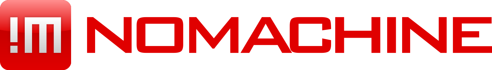

# NoMachine Password Decoder

Web-based tool to decode NoMachine scrambled passwords.

## Live

**[https://avin.github.io/nomachine-password-decode/](https://avin.github.io/nomachine-password-decode/)**

## Usage

Find the scrambled password in your NoMachine profile files (`*.nxs`):

```xml
<option key="Auth" value="8#%(*G@CDOGKLWPQTb]Z]jefgrjmozdfhj:" />
```

Paste the scrambled value into the decoder and get your password back.


